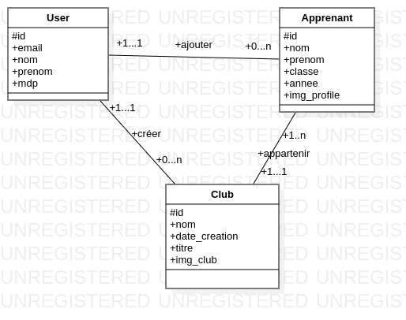
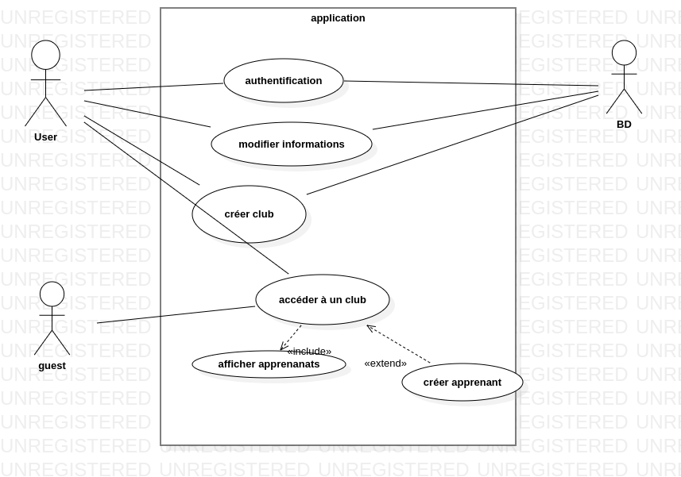
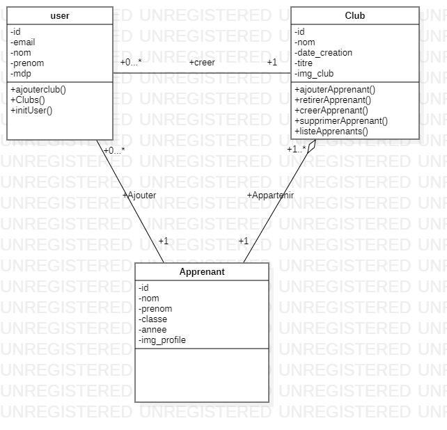
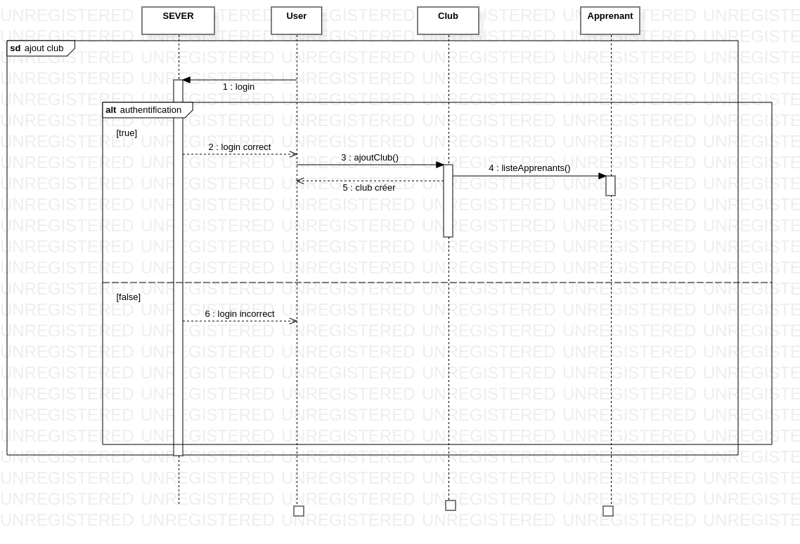
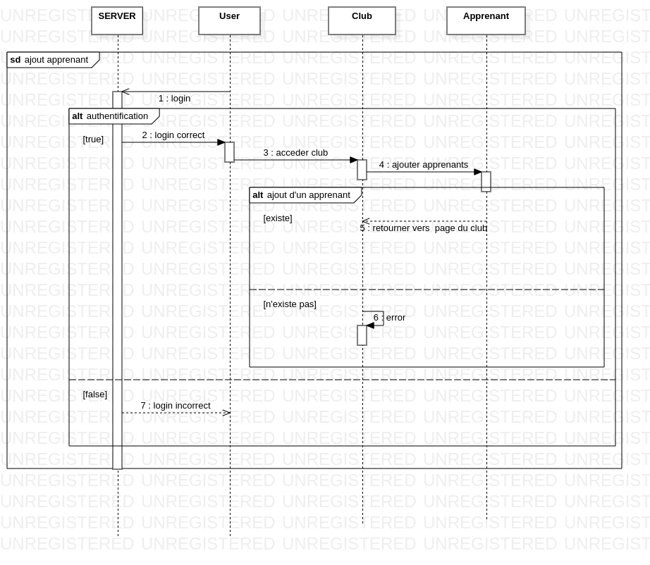

# cahier des charges!
https://docs.google.com/document/d/1eTyDjwpjnedOgCWyRauqnRXkhbmu5s3XfHIPmmDF5kM/edit?usp=sharing

# lien de trello

https://trello.com/invite/b/PyyDu4GE/ATTI06ce1a97c512747e9c2a21cf1b103b545E101B76/brief4

#conception et merise

##1-merise

##2-conecption

 - diagramme de cas d'utilisation
  
  
  
 - diagramme de classe
 
   

- diagramme de sequence(ajout d'un club)
  

- diagramme de sequence(ajout d'un apprenant)
  
